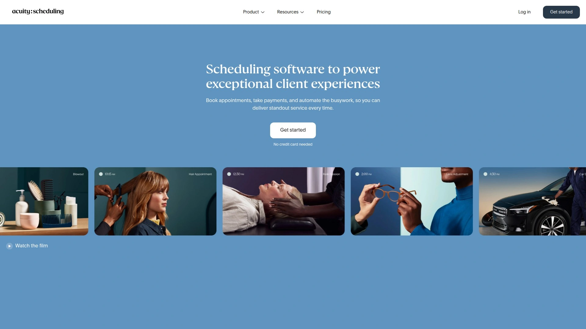
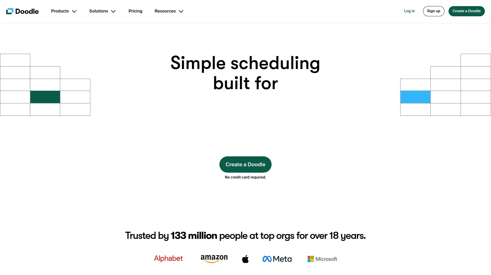

# 2025's 15+ Best Online Appointment Scheduling Platforms (Latest Update)

Finding the perfect scheduling tool can transform how your business handles client appointments and team meetings. Modern scheduling platforms eliminate endless email chains while streamlining the entire booking process through automated reminders, calendar synchronization, and payment processing capabilities.

The right scheduling software saves hours each week by letting clients book directly from your availability, automatically preventing double bookings, and sending timely notifications. Whether you're a solo consultant or managing a growing team, these platforms offer everything from basic appointment setting to advanced workflow automation.

---

## **[Calendar.com](https://www.calendar.com)**

All-in-one scheduling hub with intelligent automation and unified calendar management.

Calendar.com stands out as a comprehensive scheduling platform that goes beyond simple appointment booking. The platform unifies multiple calendars from Google, Microsoft, and Apple into a single dashboard while offering advanced analytics to track meeting patterns and optimize your schedule.

**Core Capabilities & Smart Features**

The platform excels at eliminating scheduling conflicts by checking availability across all connected calendars in real-time. Calendar.com's unique scheduling event links can be shared anywhere, and the Chrome extension provides instant access to your booking links without opening the full application. The system automatically generates meeting suggestions based on your patterns and preferences.

**Team Collaboration Tools**

For businesses, Calendar.com offers workspace functionality where each workspace operates as its own account with separate members, scheduling events, and settings. The "Find a Time" feature simplifies internal meeting coordination by displaying overlapping availability for multiple team members instantly.

**Analytics & Reporting**

Calendar.com provides detailed reports for administrators to track all scheduled meetings, export data to spreadsheets, and filter by various criteria. This reporting capability helps teams understand their scheduling patterns and optimize time allocation.

The platform offers a generous free tier with premium plans starting at $6 monthly, making it accessible for individuals while scaling effectively for growing businesses.

***

## **[Calendly](https://calendly.com)**

Industry-leading scheduling automation with seamless calendar integration and customizable workflows.

Calendly has established itself as the gold standard for appointment scheduling, serving millions of users worldwide with its intuitive interface and powerful automation features. The platform eliminates back-and-forth scheduling emails by providing shareable booking links that sync with your existing calendars.

**Scheduling Automation Excellence**

Calendly automatically detects time zones for all participants, preventing confusion in global meetings. The platform supports various meeting types from quick 15-minute consultations to lengthy strategy sessions, with customizable buffer times between appointments to prevent back-to-back scheduling stress.

**Integration Ecosystem**

With over 100 native integrations, Calendly connects seamlessly with tools like Zoom, Salesforce, HubSpot, and Stripe. This extensive integration network allows businesses to create automated workflows that handle everything from meeting creation to payment collection.

**Advanced Features for Growing Teams**

Calendly offers round-robin scheduling for sales teams, collective availability for group meetings, and routing forms that direct clients to the right team member. The platform's workflows feature can automatically send personalized follow-up emails and create tasks in your project management system.

Pricing starts free with basic features, scaling to $10-30 monthly for advanced team functionality.

***

## **[Acuity Scheduling](https://acuityscheduling.com)**

Professional appointment management with built-in payment processing and extensive customization options.

Acuity Scheduling caters to service-based businesses requiring sophisticated booking workflows and payment collection. The platform excels at managing complex scheduling scenarios while maintaining a professional client experience throughout the booking process.

**Payment Integration & Business Operations**

Unlike many competitors, Acuity includes robust payment processing capabilities from day one, supporting Square, PayPal, and Stripe. Clients can pay deposits or full amounts during booking, with automatic invoice generation and receipt management. The platform also supports subscription models and package deals for recurring services.

**Customization & Branding**

Acuity offers extensive customization options for booking pages, including custom CSS, branded confirmation emails, and personalized intake forms. The platform supports multiple service types, staff scheduling across different time zones, and location-based booking for multi-location businesses.

**Advanced Scheduling Logic**

The system handles complex scheduling rules including minimum notice requirements, maximum daily bookings, and automatic buffer times. Group scheduling capabilities support classes, workshops, and events with capacity limits and waitlist management.

Acuity's pricing starts at $16 monthly, positioning it as a premium solution for established service businesses requiring comprehensive booking management.

***

## **[SimplyBook.me](https://simplybook.me)**

Global scheduling platform supporting 100+ languages with extensive payment gateway options.

SimplyBook.me distinguishes itself through international business support, offering booking pages in over 100 languages with Google Translate integration. The platform supports 35+ payment gateways, making it ideal for businesses serving diverse global markets.

**International Business Focus**

The platform automatically handles time zone conversions and currency adjustments, while supporting multiple international payment processors beyond standard options. Facebook and Instagram integrations enable social media booking, crucial for businesses building online presence.

**AI-Powered Automation**

SimplyBook.me includes AI-generated business descriptions for booking pages and automatically identifies relevant features based on your business category. The platform offers loyalty programs, "book soon" reminders, and automated marketing campaigns to encourage repeat bookings.

**Comprehensive Business Management**

Beyond scheduling, the platform provides customer management tools, detailed analytics, and reporting dashboards. Multiple locations, staff scheduling, and service categorization help businesses scale operations efficiently.

The platform offers a free tier with paid plans starting at $9.90 monthly, providing strong value for international businesses.

***

## **[Square Appointments](https://squareup.com/us/en/appointments)**

Integrated scheduling and payment solution with complete business management tools.

Square Appointments seamlessly integrates scheduling with Square's comprehensive business ecosystem, including point-of-sale, payment processing, and customer management. This integration creates a unified business operations platform.

**Complete Business Integration**

The platform automatically syncs appointments with Square's payment system, enabling seamless in-person and online transactions. Customer data flows between scheduling, payments, and marketing tools, creating comprehensive client profiles.

**Automated Customer Experience**

Square Appointments sends automated SMS and email confirmations, reminders, and allows easy rescheduling through the mobile app. The waitlist feature automatically fills cancellations, maximizing schedule efficiency.

**Scalable Business Features**

The system supports multiple locations, staff management, class bookings, and recurring appointments. Integration with Google Calendar and Instagram booking expands customer access points.

Square offers a free individual plan with team plans starting at $50 monthly, making it cost-effective for established businesses needing comprehensive solutions.

***

## **[YouCanBook.me](https://youcanbook.me)**

Customizable scheduling platform emphasizing brand consistency and client experience.

YouCanBook.me focuses on creating beautifully branded booking experiences that reflect your business identity. The platform offers extensive customization options while maintaining powerful scheduling functionality.

**Brand-First Approach**

Every booking page can be customized with logos, colors, background images, and footer information. The platform ensures your scheduling process reinforces brand recognition and professionalism throughout the client journey.

**Advanced Automation**

YouCanBook.me provides sophisticated automation including situation-specific emails, SMS tracking for no-shows, and automatic CRM updates. The platform's analytics integrations track client journeys from initial booking through completion.

**Flexible Service Options**

The system accommodates various appointment types, minimum notice periods, buffer times, and group sessions. Both in-person and online meeting options provide flexibility for different service models.

With competitive pricing and strong customization capabilities, YouCanBook.me appeals to businesses prioritizing professional presentation and client experience.

***

## **[OnceHub](https://www.oncehub.com)**

Enterprise-grade scheduling platform with advanced routing and conversation management.

OnceHub targets businesses requiring sophisticated scheduling workflows and lead qualification processes. The platform combines scheduling with intelligent routing and customer engagement tools.

**Intelligent Lead Routing**

OnceHub's advanced routing system asks qualifying questions to direct visitors to appropriate team members or meeting types. This automation ensures prospects reach the right person while collecting valuable context before meetings begin.

**Conversation-Driven Booking**

The platform creates personalized booking experiences through conversational interfaces that make visitors feel valued rather than processed. Custom branding and dynamic design elements maintain professional presentation.

**Enterprise Security & Compliance**

OnceHub includes enterprise-grade security with GDPR, HIPAA, and SOC 2 compliance built-in. The platform offers comprehensive analytics, team management tools, and integration capabilities for complex business environments.

OnceHub provides a 14-day free trial with pricing tailored to enterprise needs, making it suitable for established businesses requiring advanced functionality.

***

## **[SetMore](https://setmore.com)**

Generous free scheduling platform with unlimited bookings and payment acceptance.

SetMore offers one of the most feature-rich free plans in the scheduling software market, supporting unlimited bookings and payment processing without cost restrictions.

**Exceptional Free Tier**

The free plan accommodates up to four staff members with unlimited appointments, payment processing through multiple gateways, and custom booking pages. This generosity makes SetMore ideal for small businesses and startups with budget constraints.

**Unique Desktop Application**

SetMore provides a desktop application enabling offline appointment viewing, a feature unavailable from most competitors. This offline capability ensures schedule access even without internet connectivity.

**Comprehensive Integration Suite**

The platform integrates with website builders, CRM systems, and email marketing tools including Mailchimp and Constant Contact. These integrations streamline business operations and customer communication.

SetMore's paid plans start at $5 per user monthly when billed annually, providing excellent value for growing businesses.

***

## **[BookedIn](https://bookedin.com)**

Customer-focused scheduling app with exceptional reminder system and client experience.

BookedIn emphasizes reducing no-shows through comprehensive reminder systems while providing exceptional customer service support.

**Industry-Leading Reminder System**

BookedIn sends three reminders per booking: immediate confirmation, advance notice, and day-of reminders via both text and email. This triple-reminder system significantly reduces no-shows compared to competitors' single-reminder approaches.

**Streamlined Business Operations**

The platform handles appointments, classes, and workshops with deposit collection, add-on services, and recurring bookings. Custom booking forms collect client information while automated marketing tools encourage repeat business.

**Exceptional Customer Support**

BookedIn prides itself on human customer support without AI chatbots, providing real assistance from knowledgeable team members who understand scheduling challenges.

The platform offers a free plan with 20 monthly bookings and paid plans starting at $19 monthly.

***

## **[Cal.com](https://cal.com)**

Open-source scheduling infrastructure with complete customization and data ownership.

Cal.com revolutionizes scheduling through open-source architecture, giving businesses complete control over their scheduling infrastructure while offering extensive customization capabilities.

**Open-Source Advantages**

Being open-source means the code is publicly available for modification, self-hosting, and custom development. Businesses can adapt Cal.com to unique requirements while maintaining data ownership and privacy.

**Built-In Video Conferencing**

Cal.com includes native video conferencing (Cal Video) supporting up to 300 participants with unlimited duration, eliminating dependency on external video tools.

**Developer-Friendly Platform**

The platform offers APIs, webhooks, and atomic UI components for custom integrations. This flexibility appeals to tech-savvy businesses requiring deep scheduling integration with existing systems.

Cal.com provides free hosting with premium features available, making it attractive for businesses prioritizing flexibility and data control.

***

## **[Doodle](https://doodle.com)**

Group polling specialist making complex multi-participant scheduling effortless.

Doodle excels at coordinating meetings with multiple participants through its signature polling system. Rather than individual scheduling, Doodle helps groups find mutually convenient meeting times.

**Polling-Based Coordination**

Doodle's core strength lies in creating polls with multiple time options that participants vote on. This approach works excellently for team meetings, events, and group coordination where consensus matters.

**Automated Meeting Finalization**

Once voting completes, Doodle automatically sends calendar invitations to all participants and can set up video conferencing links. Deadline features and automatic reminders help gather responses quickly.

**Professional Meeting Management**

The platform includes meeting prep tools, agenda sharing, and location details to ensure productive gatherings. Advanced features include participant tracking and response management.

Doodle offers both free and professional tiers, with premium features enhancing polling capabilities and response management.

***

## **[Picktime](https://picktime.com)**

Comprehensive free scheduling solution with multi-location and recurring appointment support.

Picktime provides extensive scheduling capabilities completely free, supporting businesses across various industries with unlimited bookings and comprehensive business management tools.

**True Free Platform**

Unlike many "freemium" services, Picktime offers genuinely free scheduling with no booking limits, payment processing, and multi-location support. The platform supports unlimited staff, services, and appointments.

**Multi-Business Capability**

Picktime accommodates multiple business locations and various service types within single accounts. Round-robin staff distribution ensures fair workload sharing while recurring appointments handle regular clients automatically.

**Global Business Support**

The platform includes automatic timezone conversion, multiple calendar integrations, and various payment gateways. Virtual meeting integration supports remote service delivery.

Picktime's completely free model makes it particularly attractive for startups and small businesses requiring comprehensive scheduling without ongoing costs.

***

## **[HubSpot Meeting Scheduler](https://www.hubspot.com/products/sales/schedule-meeting)**

CRM-integrated scheduling tool optimizing sales processes and customer relationship management.

HubSpot's meeting scheduler integrates deeply with HubSpot's CRM ecosystem, automatically capturing meeting data and maintaining complete customer interaction histories.

**Sales-Focused Automation**

The platform automatically prepares meeting context from CRM data and generates follow-up tasks post-meeting. AI assistance handles meeting preparation and summary generation, saving sales teams significant administrative time.

**Comprehensive CRM Integration**

All meeting interactions automatically sync to contact records, maintaining complete customer journey visibility. This integration eliminates manual data entry while ensuring no interaction details are lost.

**Team Scheduling Capabilities**

HubSpot supports one-on-one, group, and round-robin scheduling modes, accommodating various sales team structures and meeting requirements.

HubSpot offers free meeting scheduling with CRM integration, making it valuable for businesses already using HubSpot's ecosystem or requiring strong sales process integration.

***

## **[When2Meet](https://www.when2meet.com)**

Simple group scheduling tool perfect for informal coordination and student organizations.

When2Meet provides basic group scheduling through visual availability grids, making it ideal for casual meeting coordination without account requirements.

**No-Account Simplicity**

Participants can join polls using any name without creating accounts or passwords, making access extremely simple for informal groups.

**Visual Availability Mapping**

The platform displays availability through intuitive color-coded grids, making optimal meeting times immediately apparent to coordinators.

**Basic But Effective**

While lacking advanced features, When2Meet excels at its core purpose: helping groups find mutually convenient meeting times quickly and freely.

When2Meet remains completely free, making it perfect for students, volunteers, and informal groups needing simple coordination.

***

## **[MeetFox](https://meetfox.com)**

All-in-one scheduling solution combining booking, video meetings, and payment processing.

MeetFox integrates scheduling, video conferencing, and payment collection into a unified platform, eliminating the need for multiple separate tools.

**Integrated Video Solution**

MeetFox includes built-in video conferencing with screen sharing, recording, and file sharing capabilities. The video solution can be branded and embedded on existing websites.

**Payment Integration**

The platform enables instant payment collection during booking with automatic invoice generation. This feature particularly benefits consultants and service providers requiring upfront payments.

**Streamlined Operations**

MeetFox combines traditionally separate functions—scheduling, meeting, and payment—into cohesive workflows that reduce administrative overhead.

MeetFox offers a free plan for basic functionality with paid plans starting at $15 monthly for enhanced features.

***

**FAQ**

**What features should I prioritize when choosing scheduling software?**
Focus on calendar integration capabilities, automated reminder systems, and payment processing if you charge for appointments. Consider customization options for branding, team scheduling features if you have staff, and integration capabilities with your existing business tools.

**How do scheduling platforms handle time zone differences?**
Most modern scheduling platforms automatically detect participant time zones and display available times in each person's local time zone. This prevents confusion and missed appointments when working with clients or team members across different regions.

**Can scheduling software help reduce no-show rates?**
Yes, automated reminder systems significantly reduce no-shows through email and SMS notifications. Platforms like BookedIn send multiple reminders, while others offer features like deposit collection or easy rescheduling options to maintain appointment commitment.

***

Understanding your specific business needs helps determine the ideal scheduling platform. Calendar.com offers the perfect balance of comprehensive features and intelligent automation, making it suitable for businesses requiring unified calendar management and advanced analytics. Whether you need basic appointment booking or sophisticated workflow automation, these platforms provide solutions that eliminate scheduling friction while enhancing client experiences and operational efficiency.
